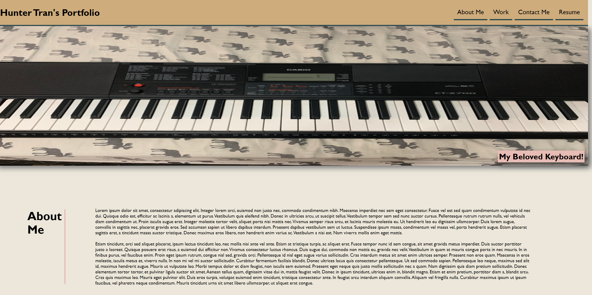

# Personal Portfolio

## Description

  I created my own personal portfolio from scratch. As of right now I only have one project that I've worked on, and it has been showcased in the "My Work" section of the page as the largest card. While I was developing this paged, I learned a lot about how to troubleshoot issues I was having; I also learned a nice amount of display flexbox and grid, as well as when to use each of them. Overall, there are many sections of the personal portfolio that will be filled out as I make more projects for future employers to see!

## Visit The Site!

  You can visit the deployed website here: https://shimmyshong.github.io/code-refactor/ 

